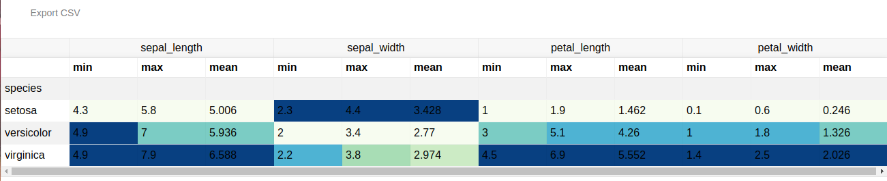

# React TAJ

Table as JSON library in React used to display JSON end-points in table and also download it as a CSV file.

### Installation

```sh
npm install react-taj

```
### Example


```sh

    import ReactTaj from 'react-taj';

    ReactDOM.render(

      <ReactTaj url='http://localhost:5000/dfmulti'
        pagination={false}
        filter={false}
      />,
      document.getElementById('root')
    );

```
##### URL content

```sh

    {
    columns: [
    [
    "sepal_length",
    "min"
    ],
    [
    "sepal_length",
    "max"
    ],
    [
    "sepal_width",
    "min"
    ],
    [
    "sepal_width",
    "max"
    ],
    [
    "petal_length",
    "min"
    ],
    [
    "petal_length",
    "max"
    ],
    [
    "petal_width",
    "min"
    ],
    [
    "petal_width",
    "max"
    ]
    ],
    index: [
    "setosa",
    "versicolor",
    "virginica"
    ],
    data: [
    [
    4.3,
    5.8,
    2.3,
    4.4,
    1,
    1.9,
    0.1,
    0.6
    ],
    [
    4.9,
    7,
    2,
    3.4,
    3,
    5.1,
    1,
    1.8
    ],
    [
    4.9,
    7.9,
    2.2,
    3.8,
    4.5,
    6.9,
    1.4,
    2.5
    ]
    ],
    index_field: "species"
    }
```
##### Output



### Properties

##### url

JSON end point such as.

```sh
http://localhost:5000/dfmulti
```

##### pagination

boolean property to show pagination or display data in one page. default false

##### filter

boolean property to show filter row or not. default false


##### colors

array of colors to make a background color for each cell based on its value high or low, such as

```sh
const colors = [
  '#762a83',
  '#9970ab',
  '#c2a5cf',
  '#e7d4e8',
  '#f7f7f7',
  '#d9f0d3',
  '#a6dba0',
  '#5aae61',
  '#1b7837'
];

```

##### className {string} default: 'taj'

The css class.


### end-point structure

- specify the JSON type in a key tableType as a value of Simple or MultiIndex.

```sh
{
schema: {
  fields: [
  {
  name: "index",
  type: "integer"
  },
  {
  name: "sepal_length",
  type: "number"
  },
  {
  name: "sepal_width",
  type: "number"
  },
  {
  name: "petal_length",
  type: "number"
  },
  {
  name: "petal_width",
  type: "number"
  },
  {
  name: "species",
  type: "string"
  }
  ],
  primaryKey: [
  "index"
  ],
  pandas_version: "0.20.0"
  },
  data: {
  sepal_length: {
    0: 5.1,
    1: 4.9,
    2: 4.7,
    3: 4.6,
    4: 5,
    5: 5.4,
    6: 4.6,
    7: 5,
    8: 4.4,
    9: 4.9,
    10: 5.4
  },
  sepal_width: {
    0: 3.5,
    1: 3,
    2: 3.2,
    3: 3.1,
    4: 3.6,
    5: 3.9,
    6: 3.4,
    7: 3.4,
    8: 2.9,
    9: 3.1,
    10: 3.7
  },
  petal_length: {
    0: 1.4,
    1: 1.4,
    2: 1.3,
    3: 1.5,
    4: 1.4,
    5: 1.7,
    6: 1.4,
    7: 1.5,
    8: 1.4,
    9: 1.5,
    10: 1.5
  },
  petal_width: {
    0: 0.2,
    1: 0.2,
    2: 0.2,
    3: 0.2,
    4: 0.2,
    5: 0.4,
    6: 0.3,
    7: 0.2,
    8: 0.2,
    9: 0.1,
    10: 0.2
  },
  species: {
    0: "setosa",
    1: "setosa",
    2: "setosa",
    3: "setosa",
    4: "setosa",
    5: "setosa",
    6: "setosa",
    7: "setosa",
    8: "setosa",
    9: "setosa",
    10: "setosa"
    }
  },
  tableType: "Simple"
}

```

### License
